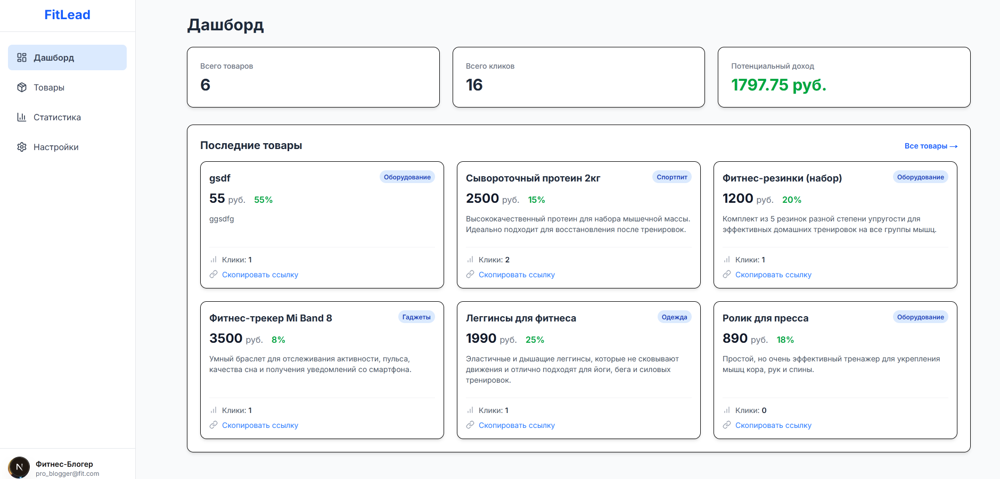

## FitLead: система управления партнерскими товарами

FitLead — fullstack-приложение для фитнес-блогеров: управление партнерскими товарами, генерация реферальных ссылок и базовая статистика по кликам и потенциальному доходу.



### Основной функционал
- Дашборд: ключевые метрики (товары, клики, потенциальный доход) и последние товары
- Управление товарами: CRUD, поиск, фильтры и сортировки
- Реферальные ссылки: редирект на оригинальный товар и учет кликов
- Статистика: топ-5 товаров по кликам, товары по категориям
- Настройки профиля: имя, email, аватар

### Технологии
- Frontend: Next.js, React, TypeScript, Tailwind CSS, Axios, Chart.js
- Backend: Node.js, Express, TypeScript, MongoDB, Mongoose, Nanoid

### Требования
- Node.js 18+
- Docker (для локальной MongoDB)

### Запуск (dev, по частям)
1) Запустите MongoDB:

```bash
docker run -d -p 27017:27017 --name db-fit-lead mongo
```

2) Установите зависимости фронта и бэка:

```bash
cd back && npm install && cd ../front && npm install && cd ..
```

3) Импортируйте тестовые данные:

```bash
cd back && npm run data:import && cd ..
```

4) Запустите по частям (в двух терминалах):

Backend
```bash
cd back
npm run dev
```

Frontend
```bash
cd front
npm start
```

После запуска:
- API: `http://localhost:5000`
- Front: `http://localhost:3000`

### Переменные окружения

1) Создайте файл `.env` в КОРНЕ репозитория (рядом с папками `back` и `front`). Бэкенд читает именно корневой `.env`.

Минимальный пример содержимого:

```env
MONGO_URI=mongodb://localhost:27017/fit-lead
# Необязательно: список разрешённых фронтенд-источников для CORS (через запятую)
FRONTEND_ORIGINS=http://localhost:3000,http://127.0.0.1:3000
```

2) (Опционально) Создайте `front/.env.local`, если нужен другой адрес API:

```env
NEXT_PUBLIC_API_URL=http://localhost:5000/api
```

### Остановка

```bash
docker stop db-fit-lead && docker rm db-fit-lead
```
